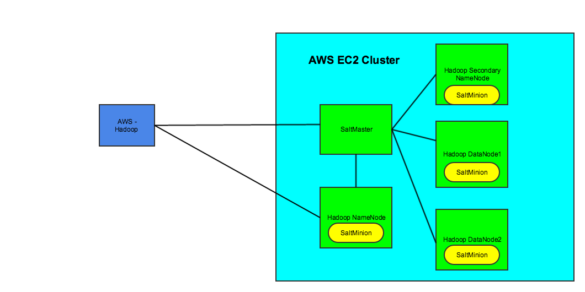
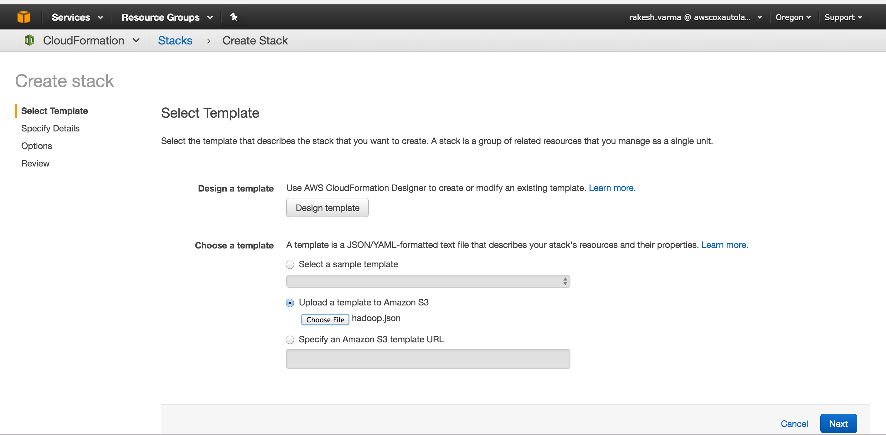

aws-hadoop
=======================
Python project that automates the creation of hadoop cluster.

 - AWS Cloudformation is used to create all the AWS resources.
 - Salt is used for configuration management. It is a used a distributed remote execution system to apply commands on hadoop nodes.
 - Python fabric is used to provide a friendly command line interface to run various tasks.


Usage
-----
Use this solution to create a hadoop cluster with any number of data nodes. This is the architectural diagram of the cluster.

Installation
------------

Create AWS Resources
-------------------------------
 Create a number of ubuntu machines (1 for saltmaster, 1 for hadoop name node, 1 for hadoop secondaryname node, and the remaining for hadoop data nodes) in AWS. Make sure you allow all the tcp ports (these are used for communication - 22, 50070, 50090, 8021, 8020)

To automate this step, follow these steps to use the cloud formation template.

 - Create a AWS keypair pem file that will allow you to ssh to AWS EC2 instances.
 - Open aws-hadoop/aws-cloudformation-template/hadoop.json,  Replace testkey with your AWS keypair. "KeyName": "testkey", The template has 5 ubuntu nodes (1 for saltmaster, 1 for hadoopnamenode, 1 for secondarynamenode and 2 datanodes). Add more datanodes as required.
 - Once your template is ready, login to AWS management console, go to cloud formation, create stack and upload the template to create the hadoop cluster.
 - Verify that all the ubuntu nodes are created.



Once all the AWS Resources are setup the next step is to provision hadoop cluster.
Provision Hadoop Cluster
----------------------------------

1. Clone the git project
    ```
    git clone https://github.com/varmarakesh/aws-hadoop
    ```
    
2. Install the python libraries (suggest using virtualenv for setting up python libraries)
    ```
        cd aws-hadoop
        virtualenv env
        source env/bin/activate
        pip install -r requirements.txt
    ```
    
3. Now in aws-hadoop/aws-hadoop, run the fab command by specifying aws keys, key_location and cloud formation stack name. Various Fabric tasks will run to complete the hadoop provisioning.

    ```
    fab \
	hadoop.keys:\
		aws_access_key_id='******',\
		aws_secret_access_key='*********',\
		aws_security_token='*******',\
		aws_key_location="/mydir/testkey.pem" \
		cloud_formation_stack='hadoop-stack' \
	hadoop.provision_hadoop_cluster
    ```

Compatibility
-------------
So far, this has been successfully tested on the following platforms.

mac osx 10.9
ubuntu server 16.04

Licence
-------

Authors
-------

`aws-hadoop` was written by `Rakesh Varma <varma.rakesh@gmail.com>`

